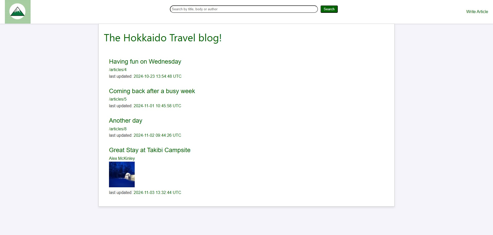
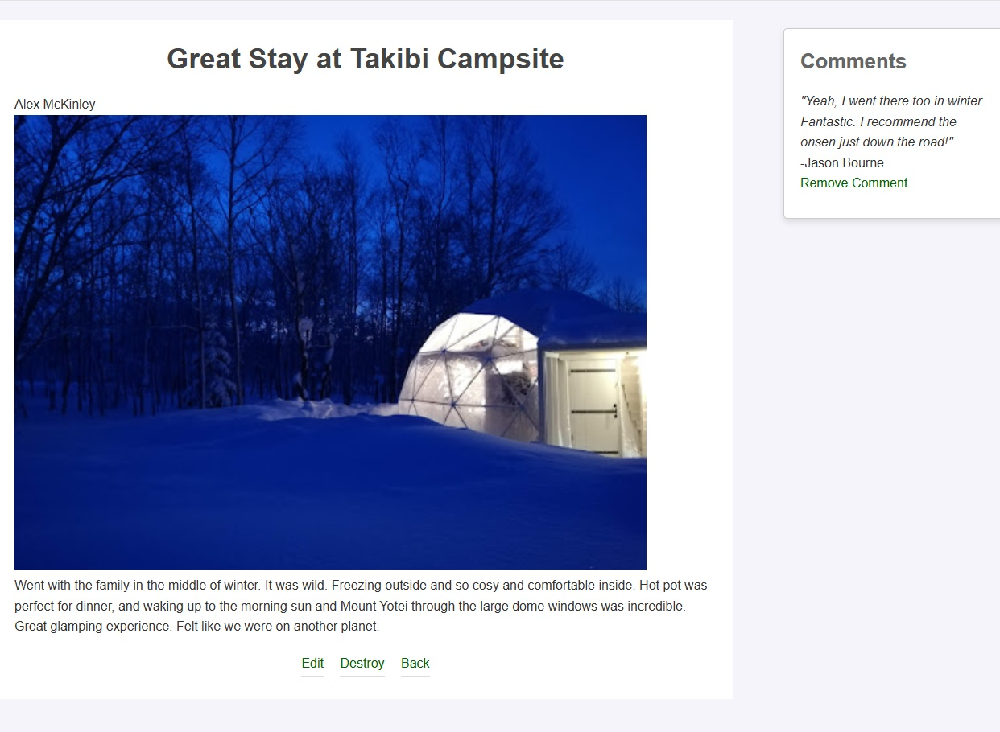

# Hokkaido Travel Blog Site
This site is a blog site for travellers to share their journeys in Hokkaido.

## Features
- CRUD operations
- Users can upload their stories with images.
- Users can comment on others' stories.
- Users can search for stories by keywords such as location name, things like "onsen" or the name of their favourite authors.

## Appearnce

## Design
This is a site made in Ruby on Rails showing a basic blog design. For the purpose of this demonstration, it is a simple uncluttered travel blog site, but it could be tailored to any other theme, with functionality and design adapted.

## Author
Alex McKinley
